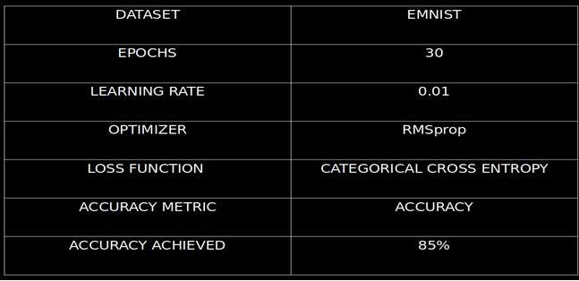

## <h2 align="center"> 
HANDWRITTEN EQUATION SOLVER
 </h2>

<h2 align= "center">Introduction</h2>
 
> 
 The application will be able to predict and solve handwritten mathematical equations from the given image. The system should be capable of solving expression involving arithmetic operations (addition, subtraction, multiplication, division) and solve equations of any degree (linear, quadratic, cubic and so on).

<h2 align= "center">Problem Statement </h2>

<h2 align= "center"></h2>
 
> 
 To develop an application that is able to predict and solve handwritten mathematical equations from the given image.

<h2 align= "center">Solution Approach</h2>
 
> 
 Key AI concepts used include OCR (Optical Character Recognition) and CNN (Convolutional Neural Networks). OCR is used to preprocess the image and segment characters, while CNN is used to predict the characters.

<h2 align= "center">Equation Slover Flow Diagram</h2>

> _Diagrammatic Approch for the workflow of Equation sloving methodology_

<h2 align= "center"> Flow Diagram of purposed solution:
</h2>

> _Diagrammatic Approch for the workflow of proposed methodology_

> 
The Frontend part has been developed using ReactJS. Here the user enters the image either by uploading or by using the sketchpad. The image is encoded to base64 format and sent to the REST-API as a POST request.The REST-API has been implemented using Flask. The request data is decoded and saved as an image locally and this image is sent to the backend where the equation is predicted and solved.The Backend has been implemented using Python, Tensorflow and OpenCV. The backend can be seen as two separate modules : Equation Prediction and Equation Solver. OpenCV is used to perform binarization and line and character segmentation. A Tensorflow model trained using the EMNIST (Extended MNIST) dataset is used to predict each of the segmented characters and the equation generated is passed as a string to the Equation Solver.The Equation Solver solves the mathematical equation and passes it back to the Frontend where it can be viewed.

<h2 align= "center">Character Segmentation:</h2>

> **The major steps include:** Noise Removal, Binarization, Thresholding and Image Segmentation.

> **Noise Removal:** 
 It may produce at the time of capturing or image transmission. Noise means, the pixels in the image show different intensity values instead of true pixel values that are obtained from image. Noise removal algorithm is the process of removing or reducing the noise from the image.

> **Binarization:** 
 Binarization is the process converting a multi-tone image into a bi-tonal image. In the case of document images, it is typical to map foreground text pixels to black and the rest of the image (background) to white.

> **Image Segmentation:** 
 Image segmentation is typically used to locate objects and boundaries (lines, curves, etc.) in images. More precisely, image segmentation is the process of assigning a label to every pixel in an image such that pixels with the same label share certain characteristics.

<h2 align= "center">Solving the Equestion:</h2>

> 
 After each of the character in the image is detected, the string containing the equation is passed to this final module which solves the equation or mathematical expression.

> The equation can be of two types :
>
> > - 
 A mathematical string such as ‘5+3’ or ‘66x3+2’ (String that is input to this module is of this format). This string can either be evaluated using a custom-built function or the eval( ) function in python.

> > - 
 A mathematical equation of any degree. The string ‘X2+5=0’ is interpreted as X\**2 + 5 since the 2 appears after the variable. Whereas 2X+5=0 is interpreted as 2*X + 5 = 0. Since prediction of even a single character leads to incorrect results/failure, simple replacements are performed on the given string to increase accuracy. These include Z -> 2, G -> 6, B -> 8 and D -> 0. The equation is solved using the SymPy library, which is a python library for symbolic computation.

> > - 
 The 2 types of equations are distinguished by checking if the equation contains ‘=‘. If the equation contains ‘=‘, it is interpreted as the 2nd type, otherwise it is interpreted as the 1st type.

<h2 align= "center">Result</h2>
 

---

 <h2 align="center"> ** Thank YOU ** </h2> 
 
 ***
